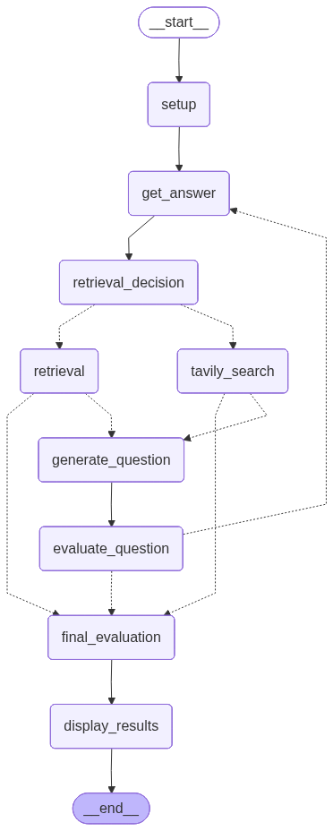

# 🎙️ AI Interview Platform — Backend & Agent Worker

This repository contains the **FastAPI backend** and **LiveKit-based agent worker** that power a real-time, voice-enabled AI interview system.

The platform supports both:

* **Individual users** practicing interviews
* **Organizations** conducting automated candidate interviews

It combines **real-time communication (WebRTC)** with **LLM-driven interview orchestration**, enabling a fully interactive, voice-based interview experience.

---

# 📚 Table of Contents
* [Demo](#-youtube-demo)

* [Architecture Overview](#-architecture-overview)
* [System Flow](#-system-flow)
* [Core Components](#-core-components)
  * [FastAPI Backend](#1-fastapi-backend)
  * [Agent Worker](#2-agent-worker)
* [Technologies Used](#-technologies-used)
* [Interview Lifecycle](#-interview-lifecycle)
* [LLM Integration & Fallback Strategy](#-llm-integration--fallback-strategy)
* [LangGraph Interview Flow](#-llm-flow)

* [Voice & Avatar Pipeline](#-voice--avatar-pipeline)
* [User vs Organization Flows](#-user-vs-organization-flows)
* [Authentication](#-authentication)
* [Database](#-database)
* [Running the Services](#-running-the-services)
* [Environment Variables](#-environment-variables)
* [Design Notes](#-design-notes)

---
# YouTube Demo

A Demo of the App can be found at the following link

```
https://youtu.be/M1Nkb4mQV1M
```

# 🧩 Architecture Overview

The system is composed of two loosely coupled services:

```
Frontend (React)
       │
       ▼
FastAPI Backend ───────► LangGraph Interview Engine
       │
       ▼
LiveKit (WebRTC)
       │
       ▼
Agent Worker (Voice + LLM + Avatar)
```

### Communication Layers

| Interaction          | Protocol               |
| -------------------- | ---------------------- |
| Frontend ↔ Agent     | WebRTC                 |
| Agent ↔ Backend      | HTTP                   |
| Backend ↔ LLM Engine | In-process / LangGraph |

This separation ensures real-time performance, scalable orchestration, and robust state management.

---

# 🔄 System Flow

1. Client requests session via `POST /join_meeting`
2. Backend creates a LiveKit room and returns access token + metadata
3. User (frontend) and Agent worker join the same room
4. Interview begins with dynamic LLM-driven conversation via WebRTC + HTTP

---

# 🧱 Core Components

## 1. FastAPI Backend

Responsible for:
- Authentication (users & organizations)
- Interview orchestration endpoints
- LiveKit room & token generation
- CV processing & vector store setup
- Persistence (MongoDB)

### Key Endpoints

| Endpoint                      | Description                          |
|-------------------------------|--------------------------------------|
| `/start_interview`            | Initializes interview state          |
| `/continue_interview`         | Advances interview with user input   |
| `/register`, `/login`         | User authentication                  |
| `/register-org`, `/login-org` | Organization authentication          |
| `/send-invite`                | Send interview invite to candidates  |

## 2. Agent Worker

A **LiveKit RTC worker** that serves as the AI interviewer.

**Responsibilities:**
- Dynamically joins LiveKit rooms
- Handles real-time voice interaction
- Delegates LLM calls to backend
- Manages session lifecycle
- Streams TTS + avatar responses

---

# 🛠️ Technologies Used

### Backend
- **FastAPI** — Web framework
- **Motor** — Async MongoDB driver
- **JWT (python-jose)** — Authentication
- **LangGraph** — Stateful interview orchestration

### Real-Time Communication
- **LiveKit** — WebRTC server & client

### Voice & AI Pipeline

| Component                | Technology                              |
|--------------------------|-----------------------------------------|
| STT (Speech-to-Text)     | AssemblyAI (`universal-streaming`)      |
| TTS (Text-to-Speech)     | ElevenLabs (`eleven_v2_flash`)          |
| Voice Activity Detection | Silero VAD                              |
| Turn Detection           | Multilingual model                      |
| Avatar Rendering         | Simli                                   |
| LLM Interface            | Multi-provider with fallback (`_safe_generate`) |

---

# 🧠 Interview Lifecycle

1. **Start Interview** (`POST /start_interview`)
   - Builds initial LangGraph state
   - Optionally embeds CV into vector store
   - Returns first question

2. **Continue Interview** (`POST /continue_interview`)
   - Processes user response
   - Updates graph state
   - Returns next question or final evaluation

3. **Completion**
   - Ends when `max_steps` is reached or graph signals completion
   - Returns detailed feedback and evaluation

---

# 🔌 LLM Integration & Fallback Strategy

The agent **does not directly host** any LLM. All LLM calls are delegated via HTTP to the backend, which uses a **multi-provider fallback system** for maximum reliability.

# 🔄 LangGraph Interview Flow

The interview logic is orchestrated using a **stateful LangGraph workflow**, enabling dynamic decision-making, retrieval augmentation, and adaptive questioning.

### Core Capabilities
- Conditional RAG retrieval (vector DB vs Tavily search)
- Dynamic question generation
- Iterative evaluation loop
- Final candidate assessment

### Flow Diagram



### Explanation

1. **Setup** initializes the interview state  
2. **Get Answer** collects user input  
3. **Retrieval Decision** determines:
   - RAG (vector DB)  
   - Tavily (web search)  
4. **Question Generation** adapts based on retrieved context  
5. **Evaluation** scores response and updates state  
6. Loop continues until `max_questions` is reached  
7. **Final Evaluation** produces overall feedback  
8. Results are displayed and interview ends  

### Safe Generation Function

```python
def _safe_generate(
    prompt: str,
    fallback: str = "",
    gemini_client=gemini_client,
    mistral_client=mistral_client,
    groq_client=groq_client,
) -> str:
    # 1️⃣ Try Gemini first (primary)
    if gemini_client:
        try:
            response = gemini_client.generate_content(prompt)
            if response:
                return response
        except Exception as e:
            logger.warning("Gemini failed: %s", e)

    # 2️⃣ Try Groq as first fallback
    if groq_client:
        try:
            response = groq_client.generate_content(prompt)
            if response:
                return response
        except Exception as e:
            logger.warning("Groq failed: %s", e)

    # 3️⃣ Try Mistral as second fallback
    if mistral_client:
        try:
            response = mistral_client.generate_content(prompt)
            if response:
                return response
        except Exception as e:
            logger.warning("Mistral failed, falling back: %s", e)

    # 4️⃣ Final fallback
    logger.warning("All LLM providers failed for prompt")
    return fallback
```

**Benefits of this approach:**
- High availability even if one provider is down or rate-limited
- Automatic graceful degradation
- No single point of failure in the LLM layer
- Easy to add more providers in the future

---

# 🎤 Voice & Avatar Pipeline

### Real-Time Flow

1. User speaks → STT (AssemblyAI)
2. Transcription sent to backend via HTTP
3. Backend processes via LangGraph + `_safe_generate`
4. Response → TTS (ElevenLabs)
5. Audio streamed back via LiveKit
6. Avatar (Simli) performs lip-sync

### Conversational Enhancements
- Dynamic filler words and natural transitions
- Human-like turn-taking behavior
- Smooth handling of interruptions

---

# 👥 User vs Organization Flows

| Feature                  | Individual Users          | Organizations                  |
|--------------------------|---------------------------|--------------------------------|
| Primary Use Case         | Interview practice        | Automated candidate screening  |
| Authentication           | `/login`                  | `/login-org`                   |
| CV Upload                | Yes                       | Not required (candidate side)  |
| Invite Candidates        | No                        | Yes (`/send-invite`)           |
| History & Analytics      | Personal history          | Team-wide results              |

---

# 🔐 Authentication

- JWT-based
- Stored in HTTP-only cookies for security
- Separate flows for users and organizations

---

# 🗄️ Database

**MongoDB** (accessed asynchronously via Motor)

**Collections:**
- `users`
- `organizations`
- `interviews`
- `rooms`
- `candidates` (for org flow)

---

# 🚀 Running the Services

## Backend

```bash
cd interviewer_chatbot/backend/
uv run uvicorn main:app --reload
```

## Agent Worker

```bash
uv run livekit_agent2.py dev
```

---

# 🔑 Environment Variables

```env
# LLM Providers
GEMINI_API_KEY=
MISTRAL_API_KEY=
GROQ_API_KEY=

# Models
GEMINI_MODEL=
GEMINI_EMBEDDING_MODEL=

# General
GOOGLE_API_KEY=
TAVILY_API_KEY=
LANGCHAIN_API_KEY=
LANGCHAIN_PROJECT=
BACKEND_URL=
DATABASE_URL=
MONGODB_URI=

# Real-time & Voice
LIVEKIT_URL=
LIVEKIT_API_SECRET=
ELEVENLABS_API_KEY=
ELEVENLABS_VOICE_ID=
ASSEMBLYAI_API_KEY=
SIMLI_API_KEY=

# Others
TAVILY_CHAT_KEY=
MAIL_USERNAME=
MAIL_PASSWORD=
SLACK_WEBHOOK_URL=
CHROMA_API_KEY=
CHROMA_API_URL=
```

---

# 🧭 Design Notes

- WebRTC is used **only** for media streaming (audio/video)
- All LLM logic is **HTTP-driven** (not real-time inside the agent)
- Agent remains **stateless** — backend + LangGraph holds all interview state
- Multi-LLM fallback ensures high reliability
- Avatar layer is **optional** (falls back gracefully to voice-only)
- System is built for **scalability and modularity**

---

**Built with reliability and realism in mind.**
